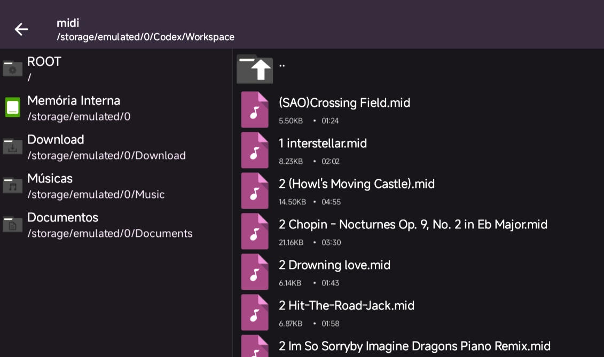

# MidiPlayer

Virtual Piano Player para o Roblox

## instalação 

Para usar é bem simples, só executar este loadstring no seu executor :)

```loadstring(game:HttpGet("https://raw.githubusercontent.com/asteeky/Midi-PC/main/package.lua"))()```

## Forma de uso

Para poder dar Play no seus Midifiles, você tem que adicionar eles a pasta "Workspace/midi/" dentro de algum gerenciador de arquivos genérico.



Eles vão ficar acessível no GUi

[Demonstração](https://www.youtube.com/watch?v=VwsENRT0pvc)

[](https://www.youtube.com/watch?v=VwsENRT0pvc)

Para selecionar as músicas de dois cliques na música

O botão circular que esta do lado do título é para ativar/desativar a visualização das notas, recomendo deixar desativado caso esteja no celular, ele causa lag


### Script original junto com o nome do autor

[richie0866](https://github.com/richie0866/MidiPlayer)
